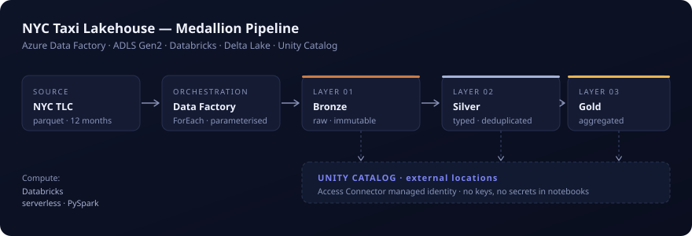

# NYC Taxi Data Pipeline 🚕

## What is this project?

This is a **real-world data engineering pipeline** that processes NYC taxi trip data (787,000+ trips from 2023). Think of it like an assembly line for data:
1. **Raw data comes in** (12 monthly files from NYC TLC)
2. **Gets cleaned and organized** (fixing errors, removing duplicates)
3. **Turns into useful dashboards** (daily stats, busiest zones, hourly trends)

**Why does this matter?** This is exactly what data engineers build at banks, Uber, and every company that moves data at scale.

---

## 🏗️ Architecture Overview



**What you're looking at:**
- **NYC TLC** (left) → Raw taxi data source
- **Data Factory** → Orchestrates when data flows (the conductor)
- **Bronze/Silver/Gold Layers** → Each stage cleans and transforms the data
- **Unity Catalog** (bottom) → Governs access securely (no passwords in code)
- **Databricks** (left side) → The compute engine that does the work

---

## 📊 How It Works (Simple Explanation)

```
NYC Taxi Data (raw files)
        ↓
    [CLEAN & ORGANIZE] ← This is where the magic happens
        ↓
    [ANALYZE & AGGREGATE] ← Turn it into dashboards
        ↓
    Ready for decision-makers
```

**What each step does:**

| Step | What it does | Why it matters |
|------|-------------|---|
| **NYC TLC Source** | Downloads all 12 months of taxi data | Brings data into our system |
| **Bronze Layer** | Stores raw data exactly as received | Keeps original source for auditing |
| **Silver Layer** | Cleans data (removes errors, duplicates) | Makes it trustworthy |
| **Gold Layer** | Creates summaries and dashboards | Ready for analysis |

---

## 🛠️ Tech Stack (What I Used)

**Why these tools?** Because this is what's used at real companies.

| What | Tool | Why |
|------|------|-----|
| **Schedule the pipeline** | Azure Data Factory | Orchestrates when data flows (like a conductor) |
| **Process the data** | Azure Databricks + PySpark | Processes 787k+ rows in seconds |
| **Store the data** | Azure Data Lake (ADLS) | Cheap, scalable storage |
| **Manage tables** | Delta Lake | ACID transactions, can "time travel" to old versions |
| **Govern access** | Unity Catalog | No passwords in code, managed identity (secure) |
| **Code** | Python | Industry standard for data work |

**Real-world context:** All of these are used at **Citigroup, Scotiabank, TD** — your target employers in Canada.

---

## 📊 What You Can Do With This

Once this pipeline runs, you can answer:
- **"How many trips happened each day?"** → Daily aggregates
- **"Which zones are busiest?"** → Zone-based summaries  
- **"What time of day gets most pickups?"** → Hourly breakdowns
- **"Did we process all data correctly?"** → Quality checks catch errors

---

## 📁 Project Structure

```
NYC_TAXI_AZURE_DATABRICKS/
│
├── README.md                   ← You are here
├── CONTRIBUTING.md             ← How to run it
├── .gitignore
│
├── assets/
│   └── architecture.svg        ← The pipeline diagram
│
├── notebooks/                  ← The actual pipeline steps
│   ├── 01_catalog_creation.py     Create tables
│   ├── 02_bronze_ingest.py        Ingest raw data
│   ├── 03_silver_transform.py     Clean data
│   └── 04_gold_aggregate.py       Create dashboards
│
├── src/                        ← Reusable Python code
│   ├── bootstrap/              Single-import setup
│   ├── config/                 Where data lives
│   ├── schema/                 Data structure definitions
│   ├── extract/                How to read files
│   ├── transform/              How to clean
│   ├── load/                   How to save
│   └── quality/                How to validate
│
├── datafactory/                ← Azure scheduling config
│   └── arm_template.json       Export of the ADF pipeline
│
└── docs/                       ← Deep dive docs
    ├── NYC_TAXI_LAKEHOUSE.md      Full architecture (technical)
    └── NYC_TAXI_Mapping_Spec.xlsx All field definitions
```

**Key insight:** Code is **modular** — not everything in one giant file. This is what professional teams do.

---

## 🎯 Key Features

### ✅ Secure (No Passwords in Code)
Instead of storing Azure account keys in notebooks (⚠️ dangerous), this uses:
- **Managed identity** via Entra ID
- **Access Connector** (brokered access)
- **Unity Catalog** (3-level namespace governance)

This is how **banks** do it. No secrets, no rotating keys.

### ✅ Production-Ready (Quality Gates)
Every layer has checks:
- **Bronze:** "Is the schema what we expect?"
- **Silver:** "Are there duplicates? Nulls in required fields?"
- **Gold:** "Did we lose more than 5% of data during cleaning?"

If anything fails, the pipeline stops. No bad data sneaks through.

### ✅ Scalable (Handles Growth)
- Uses **Delta Lake** (ACID tables, time-travel)
- **Spark parallelization** (processes data in parallel)
- Serverless execution (no cluster to manage)

Could handle 100M trips with same code.

### ✅ Maintainable (Not a Mess)
- Python modules (reusable, testable)
- Explicit schemas (catch drift early)
- Clear separation: orchestration / compute / storage

This is what **enterprise teams** look like.

---

## 🚀 Quick Start

### Prerequisites
- Azure account (free tier works)
- Databricks workspace
- 30 minutes

### Steps
1. **Clone this repo**
   ```bash
   git clone https://github.com/ParthibanKumar/NYC_TAXI_AZURE_DATABRICKS.git
   cd NYC_TAXI_AZURE_DATABRICKS
   ```

2. **Read the setup guide**
   ```bash
   Open CONTRIBUTING.md
   ```

3. **Follow the notebooks in order**
   - Start with `01_catalog_creation.py`
   - Then `02_bronze_ingest.py`
   - Then `03_silver_transform.py`
   - Finally `04_gold_aggregate.py`

4. **Check the results**
   - Run a query on the Gold tables
   - See your daily/zonal/hourly aggregates

**Full setup guide:** See [`CONTRIBUTING.md`](CONTRIBUTING.md)

---

## 🔍 For Recruiters / Hiring Managers

**What this demonstrates:**

✅ **Data Engineering Fundamentals**
- Medallion architecture (Bronze/Silver/Gold)
- ETL pipeline design
- Spark/PySpark expertise
- Delta Lake & ACID semantics

✅ **Cloud Platform Mastery**
- Azure Data Factory orchestration
- Databricks serverless compute
- ADLS hierarchical namespace
- Unity Catalog governance

✅ **Software Engineering Practices**
- Modular Python (importable, testable)
- Configuration management (no hardcoded paths)
- Explicit schema definitions (catch drift)
- Data quality gates (fail-fast)

✅ **Production Thinking**
- No secrets in code (managed identity)
- Immutable audit trails (Bronze layer)
- Rejection-rate gates (quality thresholds)
- Explicit vs. inferred schemas (maintainability)

**Transferable Skills:**
- Could rebuild this in Snowflake + Airflow (same patterns)
- Could rebuild in dbt + Spark (same architecture)
- The concepts transfer to Kafka streaming (just-in-time instead of batch)

---

## 📚 Learn More

- **Want to understand the architecture in detail?** → Read [`docs/NYC_TAXI_LAKEHOUSE.md`](docs/NYC_TAXI_LAKEHOUSE.md)
- **Want field-level mapping?** → See [`docs/NYC_TAXI_Mapping_Spec.xlsx`](docs/NYC_TAXI_Mapping_Spec.xlsx)
- **Want to run this yourself?** → Follow [`CONTRIBUTING.md`](CONTRIBUTING.md)
- **Want to extend it?** → See "Extensions" below

---

## 🔄 Possible Extensions

Want to build on this? Here are ideas:

- **Airflow DAG** — Replace Azure Data Factory with Apache Airflow (more portable)
- **Snowflake consumption** — Add a Snowflake mirror of Gold tables (BI-ready)
- **Streaming layer** — Add Kafka → Real-time taxi events (instead of batch)
- **Incremental loads** — Use `MERGE` instead of full rewrites (faster, cheaper)
- **CI/CD pipeline** — Dev → Prod promotion via GitHub Actions
- **dbt integration** — Transform data using declarative SQL (dbt models)

---

## 💡 Why I Built This

**Background:** 8 years of enterprise ETL (Ab Initio) at a major financial services firm. This project is my transition to the modern cloud data stack, learning:
- How cloud platforms (Azure) organize data differently
- How managed services (Databricks, Data Factory) replace on-prem tools
- How governance shifted from secrets → managed identity
- How the Medallion architecture replaces legacy layer design

**Ab Initio → Modern Stack Mapping:**
- `Ab Initio Co>Op` → Spark parallelization
- `Ab Initio Rollup` → Spark groupBy + aggregation
- `Ab Initio Lookup File` → Broadcast join
- `Ab Initio Conduct>It` → Airflow DAG / Data Factory

---

## 🎓 What I Learned Building This

1. **Data pipelines are about trust** — Quality gates catch problems before they hit dashboards
2. **Security isn't optional** — Managed identity → no secrets in code ever
3. **Modularity scales** — Reusable functions beat copy-paste every time
4. **Cloud is different** — Serverless, managed identities, and external tables require rethinking
5. **Documentation matters** — Explicit schemas catch drift in production

---

## 📞 Questions?

- **"How do I run this?"** → See [`CONTRIBUTING.md`](CONTRIBUTING.md)
- **"Why did you choose this approach?"** → See [`docs/NYC_TAXI_LAKEHOUSE.md`](docs/NYC_TAXI_LAKEHOUSE.md)
- **"What if my data looks different?"** → The pipeline is modular; swap `extract/reader.py` with your own source
- **"Can I adapt this for my data?"** → Yes! The Medallion pattern works for any tabular data

---

## 📄 License

Open source. Use for learning, extend as you like.

---

**Building my way into Toronto's data engineering scene. If this helped, star it! ⭐**

---

## 🤝 Contributing

Pull requests welcome! Before contributing:
1. Check [`CONTRIBUTING.md`](CONTRIBUTING.md) for setup
2. Run the pipeline end-to-end
3. Add tests for any new modules

---

**Last updated:** 2024 | **Status:** Ready to use
